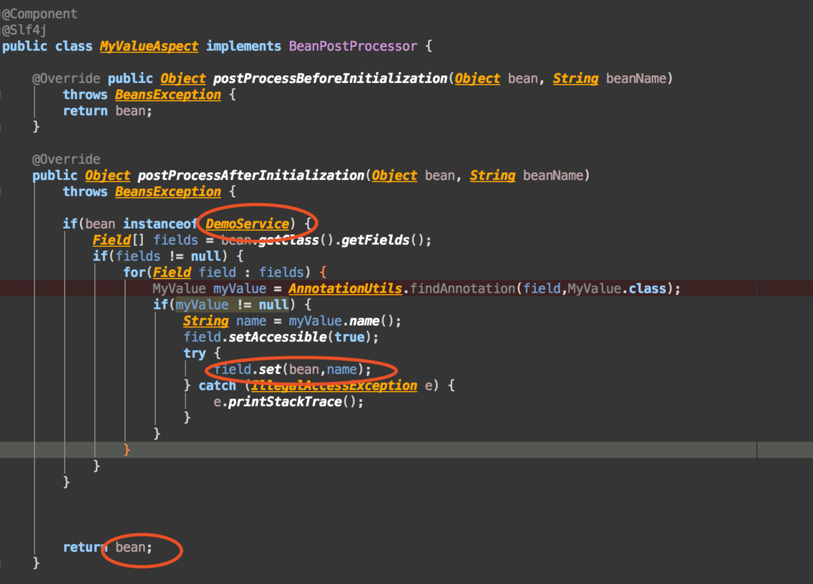
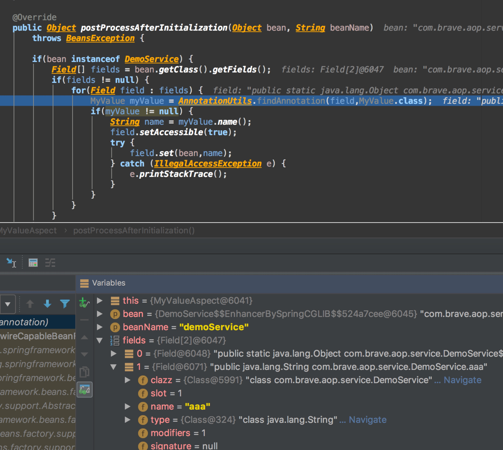
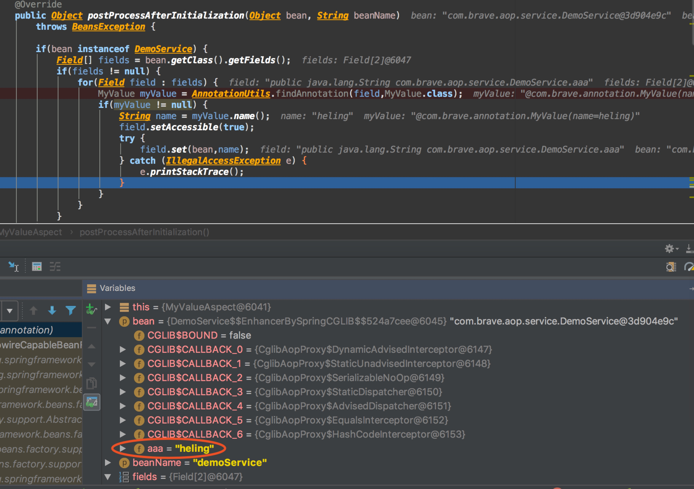
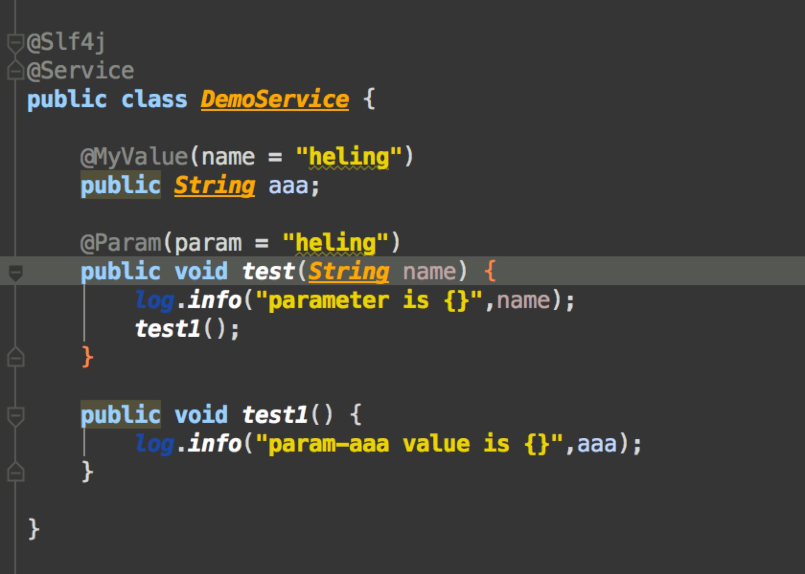
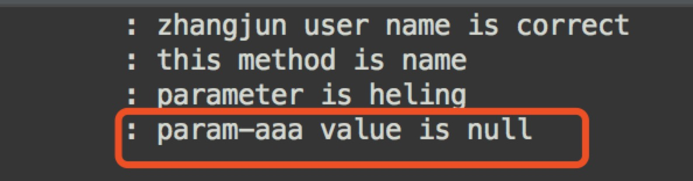

# BeanPostProcessor使用
## 简介-摘录自网上
BeanPostProcessor是Spring中定义的一个接口，其与之前介绍的InitializingBean和DisposableBean接口类似，也是供Spring进行回调的。Spring将在初始化bean前后对BeanPostProcessor实现类进行回调，与InitializingBean和DisposableBean接口不同的是BeanPostProcessor接口将对所有的bean都起作用，即所有的bean初始化前后都会回调BeanPostProcessor实现类，而InitializingBean和DisposableBean接口是针对单个bean的，即只有在对应的bean实现了InitializingBean或DisposableBean接口才会对其进行回调。

```
public interface BeanPostProcessor {

    Object postProcessBeforeInitialization(Object bean, String beanName) throws BeansException;

    Object postProcessAfterInitialization(Object bean, String beanName) throws BeansException;

}
```

## 使用说明
开发过程中，在实现一个自定义注解：

```
Component
@Slf4j
public class MyValueAspect implements BeanPostProcessor {

    @Override public Object postProcessBeforeInitialization(Object bean, String beanName)
        throws BeansException {
        return bean;
    }

    @Override
    public Object postProcessAfterInitialization(Object bean, String beanName)
        throws BeansException {

        if(bean instanceof DemoService) {
            Field[] fields = bean.getClass().getFields();
            if(fields != null) {
                for(Field field : fields) {
                    MyValue myValue = AnnotationUtils.findAnnotation(field,MyValue.class);
                    if(myValue != null) {
                        String name = myValue.name();
                        field.setAccessible(true);
                        try {
                            field.set(bean,name);
                            field.setAccessible(false);
                        } catch (IllegalAccessException e) {
                            e.printStackTrace();
                        }
                    }
                }
            }
        }


        return bean;
    }

```

理论上，这个时候容器中的bean会发生改变，如下图：

但是，实际在获取DemoService这个对应的属性aaa的时候，是空，如下是调试过程：





后面发现，demoService层做了aspect。也就是说，这个时候改变的是代理类的属性，没有改变本身父类的属性。去掉了aop后，一切正常。

