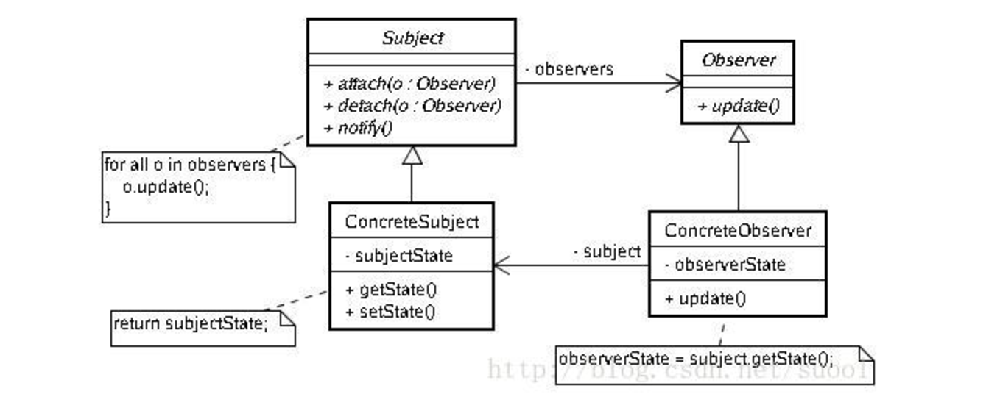

# observer pattern

* 被观察者
```
public class DemoObservable extends Observable {
    private String param;

    public String getParam(){
        return this.param;
    }

    public void setParam(String param){
        this.param = param;
        setChanged();
        notifyObservers();
    }
}
```
在状态变化的时候，需要改变状态通知，然后通知观察者。
* 观察者
```
public class DemoObserver implements Observer {
    @Override
    public void update(Observable o, Object arg) {
        DemoObservable demoObservable = (DemoObservable) o;
        System.out.println("观察者模式，接收到改变信息："+((DemoObservable) o).getParam());
    }
}
```
观察者需要实现update方法。一般做法需要关注下update方法实现后，是否需要把状态改回来，即setChanged(false);

* 测试类
```
public class TestDemo {
    public static void main(String[] args){
        DemoObservable demoObservable = new DemoObservable();
        DemoObserver demoObserver = new DemoObserver();
        demoObservable.addObserver(demoObserver);
        demoObservable.setParam("123123");
    }
}
```
* 测试结果
```
观察者模式，接收到改变信息：123123
```