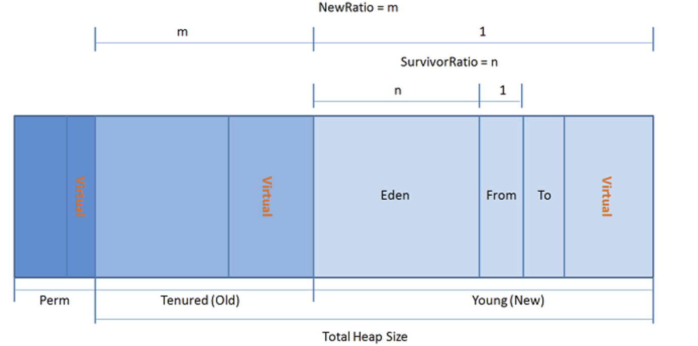
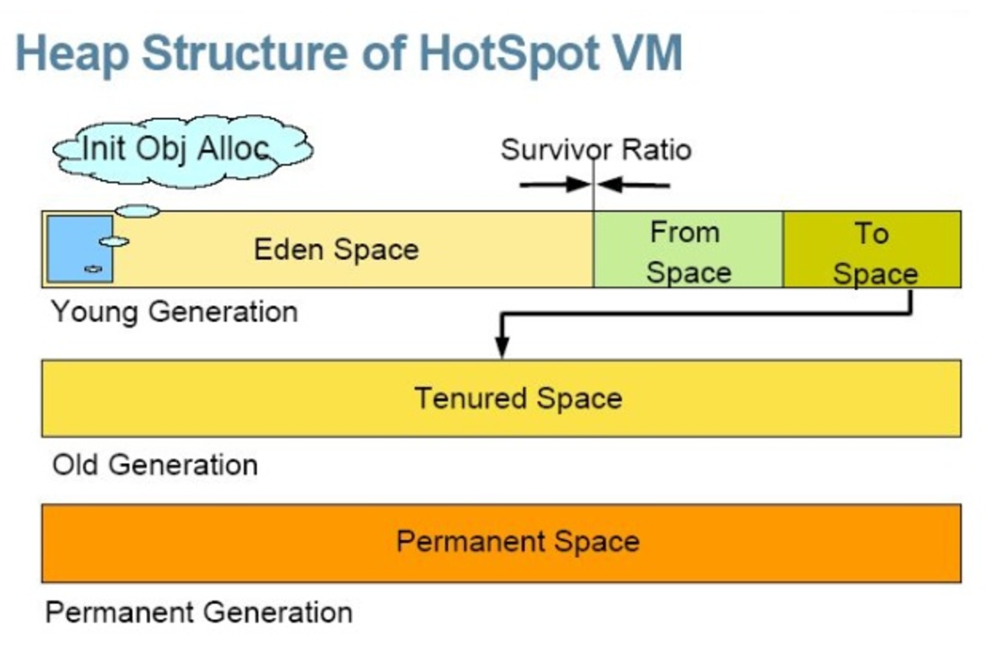

# java内存模型及gc原理

一个优秀Java程序员，必须了解Java内存模型、GC工作原理，以及如何优化GC的性能、与GC进行有限的交互，有一些应用程序对性能要求较高，例如嵌入式系统、实时系统等，只有全面提升内存的管理效率，才能提高整个应用程序的性能。
本文将从JVM内存模型、GC工作原理，以及GC的几个关键问题进行探讨，从GC角度提高Java程序的性能。

一、**Java内存模型**

按照官方的说法：Java虚拟机具有一个堆，堆是运行时数据区域，所有类实例和数组的内存均从此处分配。

JVM主要管理两种类型内存：堆和非堆，堆内存（Heap Memory）是在Java虚拟机启动时创建，非堆内存(Non-heap Memory)是在JVM堆之外的内存。简单来说，堆是Java代码可及的内存，留给开发人员使用的；非堆是JVM留给自己用的，包含方法区、JVM内部处理或优化所需的内存（如 JIT Compiler，Just-in-time Compiler，即时编译后的代码缓存）、每个类结构（如运行时常数池、字段和方法数据）以及方法和构造方法的代码。

JVM 内存包含如下几个部分：

* 堆内存（Heap Memory）： 存放Java对象
* 非堆内存（Non-Heap Memory）： 存放类加载信息和其它meta-data
* 其它（Other）： 存放JVM 自身代码等

在JVM启动时，就已经保留了固定的内存空间给Heap内存，这部分内存并不一定都会被JVM使用，但是可以确定的是这部分保留的内存不会被其他进程使用，这部分内存大小由**-Xmx**参数指定。而另一部分内存在JVM启动时就分配给JVM，作为JVM的初始Heap内存使用，这部分内存是由** -Xms **参数指定。

二、**Java内存分配**

Java的内存管理实际上就是变量和对象的管理，其中包括对象的分配和释放。


JVM内存申请过程如下：

* JVM 会试图为相关Java对象在Eden中初始化一块内存区域
* 当Eden空间足够时，内存申请结束；否则到下一步
* JVM 试图释放在Eden中所有不活跃的对象（这属于1或更高级的垃圾回收）,释放后若Eden空间仍然不足以放入新对象，则试图将部分Eden中活跃对象放入Survivor区
* Survivor区被用来作为Eden及OLD的中间交换区域，当OLD区空间足够时，Survivor区的对象会被移到Old区，否则会被保留在Survivor区
* 当OLD区空间不够时，JVM 会在OLD区进行完全的垃圾收集（0级）
* 完全垃圾收集后，若Survivor及OLD区仍然无法存放从Eden复制过来的部分对象，导致JVM无法在Eden区为新对象创建内存区域，则出现”out of memory”错误

三、**GC基本原理**

GC（Garbage Collection)，是JAVA/.NET中的垃圾收集器。

Java是由C++发展来的，它摈弃了C++中一些繁琐容易出错的东西，引入了计数器的概念，其中有一条就是这个GC机制（C#借鉴了JAVA）

编程人员容易出现问题的地方，忘记或者错误的内存回收会导致程序或系统的不稳定甚至崩溃，Java提供的GC功能可以自动监测对象是否超过作用域从而达到自动回收内存的目的，Java语言没有提供释放已分配内存的显示操作方法。所以，Java的内存管理实际上就是对象的管理，其中包括对象的分配和释放。

对于程序员来说，分配对象使用new关键字；释放对象时，只要将对象所有引用赋值为null，让程序不能够再访问到这个对象，我们称该对象为"不可达的".GC将负责回收所有"不可达"对象的内存空间。

对于GC来说，当程序员创建对象时，GC就开始监控这个对象的地址、大小以及使用情况。通常，GC采用有向图的方式记录和管理堆（heap）中的所有对象。通过这种方式确定哪些对象是"可达的"，哪些对象是"不可达的".当GC确定一些对象为"不可达"时，GC就有责任回收这些内存空间。但是，为了保证 GC能够在不同平台实现的问题，Java规范对GC的很多行为都没有进行严格的规定。例如，对于采用什么类型的回收算法、什么时候进行回收等重要问题都没有明确的规定。因此，不同的JVM的实现者往往有不同的实现算法。这也给Java程序员的开发带来行多不确定性。本文研究了几个与GC工作相关的问题，努力减少这种不确定性给Java程序带来的负面影响。

四、**GC分代划分**

JVM内存模型中Heap区分两大块，一块是 Young Generation，另一块是Old Generation。


* 在Young Generation中，有一个叫Eden Space的空间，主要是用来存放新生的对象，还有两个Survivor Spaces（from、to），它们的大小总是一样，它们用来存放每次垃圾回收后存活下来的对象。
* 在Old Generation中，主要存放应用程序中生命周期长的内存对象。
* 在Young Generation块中，垃圾回收一般用Copying的算法，速度快。每次GC的时候，存活下来的对象首先由Eden拷贝到某个SurvivorSpace，当Survivor Space空间满了后，剩下的live对象就被直接拷贝到OldGeneration中去。因此，每次GC后，Eden内存块会被清空。
* 在Old Generation块中，垃圾回收一般用mark-compact的算法，速度慢些，但减少内存要求。
* 垃圾回收分多级，0级为全部(Full)的垃圾回收，会回收OLD段中的垃圾；1级或以上为部分垃圾回收，只会回收Young中的垃圾，内存溢出通常发生于OLD段或Perm段垃圾回收后，仍然无内存空间容纳新的Java对象的情况。

五、**增量式GC**

增量式GC（Incremental GC），是GC在JVM中通常是由一个或一组进程来实现的，它本身也和用户程序一样占用heap空间，运行时也占用CPU。

当GC进程运行时，应用程序停止运行。因此，当GC运行时间较长时，用户能够感到Java程序的停顿，另外一方面，如果GC运行时间太短，则可能对象回收率太低，这意味着还有很多应该回收的对象没有被回收，仍然占用大量内存。因此，在设计GC的时候，就必须在停顿时间和回收率之间进行权衡。一个好的GC实现允许用户定义自己所需要的设置，例如有些内存有限的设备，对内存的使用量非常敏感，希望GC能够准确的回收内存，它并不在意程序速度的快慢。另外一些实时网络游戏，就不能够允许程序有长时间的中断。

增量式GC就是通过一定的回收算法，把一个长时间的中断，划分为很多个小的中断，通过这种方式减少GC对用户程序的影响。虽然，增量式GC在整体性能上可能不如普通GC的效率高，但是它能够减少程序的最长停顿时间。

Sun JDK提供的HotSpot JVM就能支持增量式GC。HotSpot JVM缺省GC方式为不使用增量GC，为了启动增量GC，我们必须在运行Java程序时增加-Xincgc的参数。

HotSpot JVM增量式GC的实现是采用Train GC算法，它的基本想法就是：将堆中的所有对象按照创建和使用情况进行分组（分层），将使用频繁高和具有相关性的对象放在一队中，随着程序的运行，不断对组进行调整。当GC运行时，它总是先回收最老的（最近很少访问的）的对象，如果整组都为可回收对象，GC将整组回收。这样，每次GC运行只回收一定比例的不可达对象，保证程序的顺畅运行。


六、**详解函数finalize**

finalize 是位于Object类的一个方法，详见我的开源项目：[src-jdk1.7.0_02](http://code.google.com/p/jdk-java/source/browse/trunk/src-jdk1.7.0_02/java/lang/Object.java)

protected void finalize() throws Throwable { }

该方法的访问修饰符为protected，由于所有类为Object的子类，因此用户类很容易访问到这个方法。

由于，finalize函数没有自动实现链式调用，我们必须手动的实现，因此finalize函数的最后一个语句通常是 super.finalize（）。通过这种方式，我们可以实现从下到上实现finalize的调用，即先释放自己的资源，然后再释放父类的资源。根据Java语言规范，JVM保证调用finalize函数之前，这个对象是不可达的，但是JVM不保证这个函数一定会被调用。另外，规范还保证finalize函数最多运行一次。

很多Java初学者会认为这个方法类似与C++中的析构函数，将很多对象、资源的释放都放在这一函数里面。其实，这不是一种很好的方式，原因有三：

其一、GC为了能够支持finalize函数，要对覆盖这个函数的对象作很多附加的工作。

其二、在finalize运行完成之后，该对象可能变成可达的，GC还要再检查一次该对象是否是可达的。因此，使用 finalize会降低GC的运行性能。

其三、由于GC调用finalize的时间是不确定的，因此通过这种方式释放资源也是不确定的。

通常，finalize用于一些不容易控制、并且非常重要资源的释放，例如一些I/O的操作，数据的连接。这些资源的释放对整个应用程序是非常关键的。在这种情况下，程序员应该以通过程序本身管理（包括释放）这些资源为主，以finalize函数释放资源方式为辅，形成一种双保险的管理机制，而不应该仅仅依靠finalize来释放资源。

下面给出一个例子说明，finalize函数被调用以后，仍然可能是可达的，同时也可说明一个对象的finalize只可能运行一次。

```
class MyObject {  
    Test main;      // 记录Test对象，在finalize中时用于恢复可达性  
  
    public MyObject(Test t) {  
        main = t;   // 保存Test 对象  
    }  
  
    protected void finalize() {  
        main.ref = this;    // 恢复本对象，让本对象可达  
        System.out.println("This is finalize");     // 用于测试finalize只运行一次  
    }  
}  
  
class Test {  
    MyObject ref;  
  
    public static void main(String[] args) {  
        Test test = new Test();  
        test.ref = new MyObject(test);  
        test.ref = null;    // MyObject对象为不可达对象，finalize将被调用  
        System.gc();  
        if (test.ref != null)  
            System.out.println("My Object还活着");  
    }  
}  
```

运行结果：

This is finalize

My Object还活着

此例子中需要注意，虽然MyObject对象在finalize中变成可达对象，但是下次回收时候，finalize却不再被调用，因为finalize函数最多只调用一次。

七、**GC程序交互**

程序如何与GC进行交互呢？ Java2增强了内存管理功能，增加了一个java.lang.ref包，详见我的开源项目：src-jdk1.7.0_02

其中定义了三种引用类。这三种引用类分别为：SoftReference、 WeakReference、 PhantomReference

通过使用这些引用类，程序员可以在一定程度与GC进行交互，以便改善GC的工作效率，这些引用类的引用强度介于可达对象和不可达对象之间。

创建一个引用对象也非常容易，例如：如果你需要创建一个Soft Reference对象，那么首先创建一个对象，并采用普通引用方式（可达对象）；然后再创建一个SoftReference引用该对象；最后将普通引用设置为null。通过这种方式，这个对象就只有一个Soft Reference引用。同时，我们称这个对象为Soft Reference 对象。

Soft Reference的主要特点是据有较强的引用功能。只有当内存不够的时候，才进行回收这类内存，因此在内存足够的时候，它们通常不被回收。另外，这些引用对象还能保证在Java抛出OutOfMemory 异常之前，被设置为null。它可以用于实现一些常用图片的缓存，实现Cache的功能，保证最大限度的使用内存而不引起OutOfMemory。以下给出这种引用类型的使用伪代码：
```
// 申请一个图像对象  
　Image image=new Image();       // 创建Image对象  
　…  
　// 使用 image  
　…  
　// 使用完了image，将它设置为soft 引用类型，并且释放强引用；  
　SoftReference sr=new SoftReference(image);  
　image=null;  
　…  
　// 下次使用时  
　if (sr!=null)   
    image=sr.get();  
　else{  
　       image=new Image();  //由于GC由于低内存，已释放image，因此需要重新装载；  
　       sr=new SoftReference(image);  
　}  
```

Weak引用对象与Soft引用对象的最大不同就在于：GC在进行回收时，需要通过算法检查是否回收Soft引用对象，而对于Weak引用对象，GC总是进行回收。Weak引用对象更容易、更快被GC回收。虽然，GC在运行时一定回收Weak对象，但是复杂关系的Weak对象群常常需要好几次GC的运行才能完成。Weak引用对象常常用于Map结构中，引用数据量较大的对象，一旦该对象的强引用为null时，GC能够快速地回收该对象空间。

Phantom引用的用途较少，主要用于辅助finalize函数的使用。Phantom对象指一些对象，它们执行完了finalize函数，并为不可达对象，但是它们还没有被GC回收。这种对象可以辅助finalize进行一些后期的回收工作，我们通过覆盖Reference的clear()方法，增强资源回收机制的灵活性。
