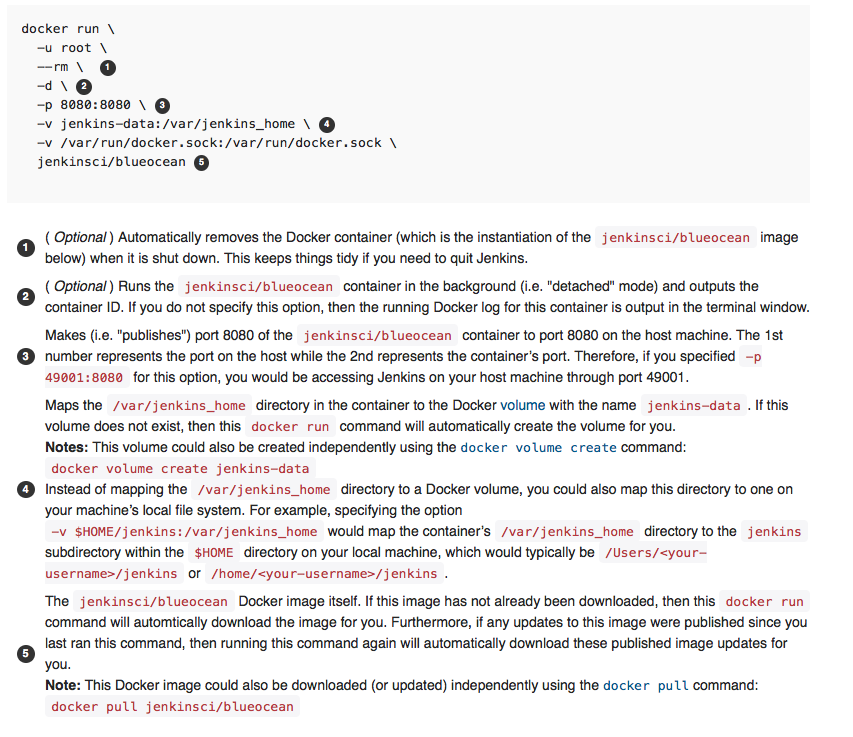
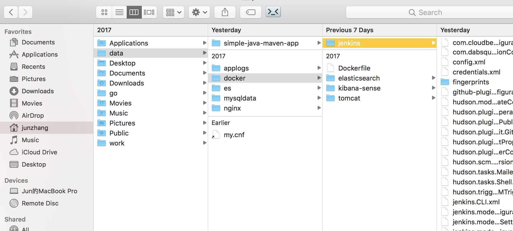
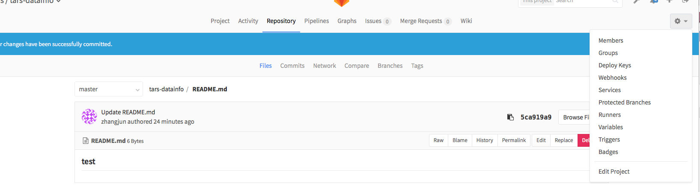
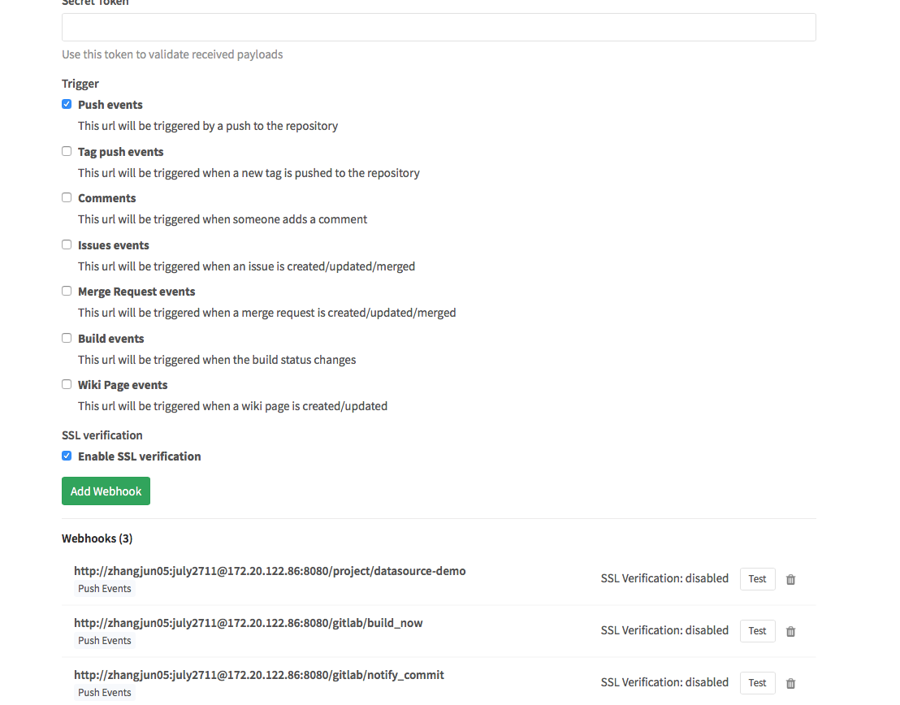
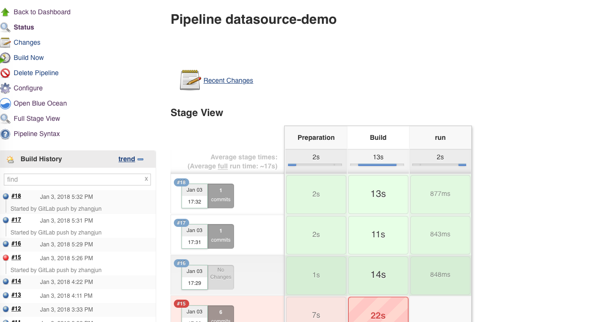
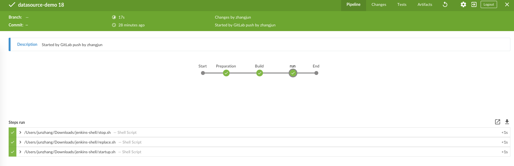

# CI 说明
请参见[jenkins官网](https://jenkins.io/doc/pipeline/tour/getting-started/)

## jenkins安装
### 两种方式
* docker方式-建议安装[blue ocean版本](https://jenkins.io/doc/book/blueocean/getting-started/#blueocean-docker)
* war包方式，单点部署。启动命令：java -jar -DhttpPort=8080 -Dhudson.util.ProcessTree.disable=true  jenkins.war


### docker启动命令
可以参见官网的启动方式


这里需要指定好jenkins的目录，和本地目录的映射关系。如我本地就是


安装完成后，和本地使用没有什么区别了。


## ci配置

### jenkins配置：
 * step1: jenkins主页面->new item
 * step2: 填写项目名字,选择pipeline
 * step3: 进入主页面，安装几个插件：gitlab plugin 还有一个是gitlab hook plugin。
 * step4: 在刚才的item的配置页面，进入build triggers
 * step5: 选择“uild when a change is pushed to GitLab. GitLab CI Service URL: http://localhost:8080/project/datasource-demo”
 * 在pipline中选择script,具体的变量自己按照机器定义
```
node {
   def mvnHome
   stage('Preparation') { // for display purposes
      // Get some code from a GitHub repository
      git 'http://gitlab.paifenlecorp.com/tars/tars-datainfo.git'
      // Get the Maven tool.
      // ** NOTE: This 'M3' Maven tool must be configured
      // **       in the global configuration.           
      mvnHome = '/usr/local/maven/apache-maven-3.3.9'
   }
   stage('Build') {
      // Run the maven build
      if (isUnix()) {
         sh "'${mvnHome}/bin/mvn' -Dmaven.test.failure.ignore clean package"
      } else {
         bat(/"${mvnHome}\bin\mvn" -Dmaven.test.failure.ignore clean package/)
      }
   }
   stage('run') {
       sh "/Users/junzhang/Downloads/jenkins-shell/stop.sh"
       sh "/Users/junzhang/Downloads/jenkins-shell/replace.sh"
       sh "/Users/junzhang/Downloads/jenkins-shell/startup.sh"
       
   }
}
```

* stop脚本
```
# 将应用停止
#stop.sh
#!/bin/bash
echo "Stopping SpringBoot Application"
pid=`ps -ef | grep demo.jar | grep -v grep | awk '{print $2}'`
if [ -n "$pid" ]
then
   kill -9 $pid
fi
```

* replace脚本
```
#replace.sh 用于将上次构建的结果备份，然后将新的构建结果移动到合适的位置
#!/bin/bash
# 先判断文件是否存在，如果存在，则备份
cd /Users/junzhang/.jenkins/workspace/datasource-demo/
#mvn clean install -Dmaven.test.skip
file="/usr/local/SBA/model.jar"
if [ -f "$file" ]
then
   mv /Users/junzhang/.jenkins/workspace/datasource-demo/target/tars-datainfo-1.0-SNAPSHOT.jar  /Users/junzhang/Downloads/jenkins-shell/demo.jar.`date +%Y%m%d%H%M%S`
fi
mv /Users/junzhang/.jenkins/workspace/datasource-demo/target/tars-datainfo-1.0-SNAPSHOT.jar  /Users/junzhang/Downloads/jenkins-shell/demo.jar

```

* startup脚本
```
# startup.sh 启动项目
#!/bin/sh
echo "授予当前用户权限"
chmod 777 /Users/junzhang/Downloads/jenkins-shell/demo.jar
echo "执行....."
BUILD_ID=dontKillMe nohup java -jar  /Users/junzhang/Downloads/jenkins-shell/demo.jar  > server.log 2>&1 &
```

### gitlab配置
* 进入项目的配置页面，选择webhooks

* 新建一个webhook


## 最终效果
在gitlab上提交一个代码这个时候会自动触发


在blue ocean上也能看到编译的步骤：

