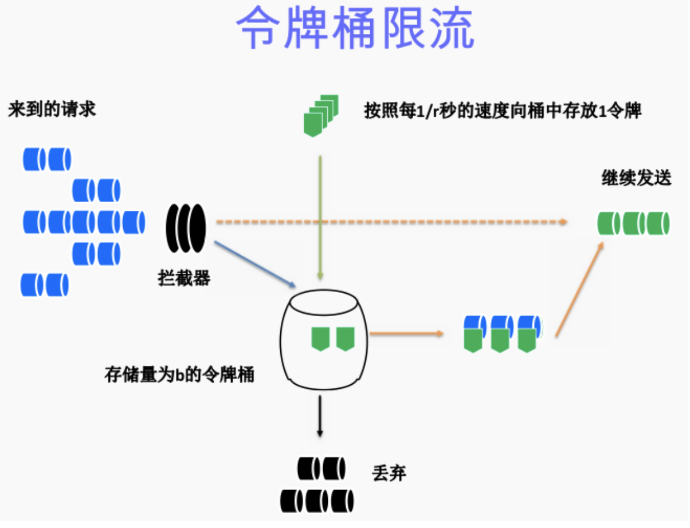
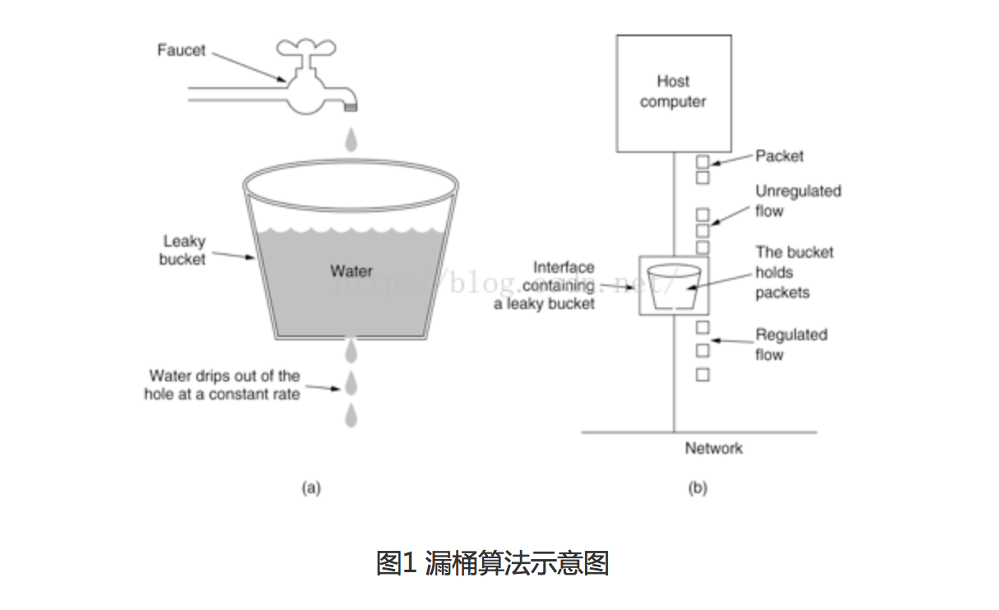
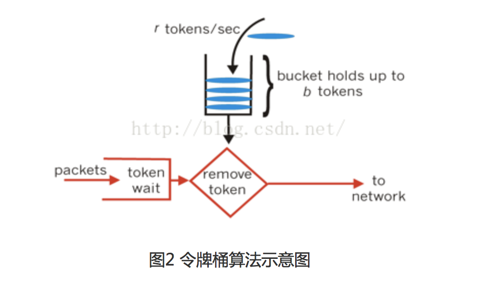

# 令牌桶算法限流

## 简介

令牌桶算法最初来源于计算机网络。在网络传输数据时，为了防止网络拥塞，需限制流出网络的流量，使流量以比较均匀的速度向外发送。令牌桶算法就实现了这个功能，可控制发送到网络上数据的数目，并允许突发数据的发送。

令牌桶算法是网络流量整形（Traffic Shaping）和速率限制（Rate Limiting）中最常使用的一种算法。典型情况下，令牌桶算法用来控制发送到网络上的数据的数目，并允许突发数据的发送。

大小固定的令牌桶可自行以恒定的速率源源不断地产生令牌。如果令牌不被消耗，或者被消耗的速度小于产生的速度，令牌就会不断地增多，直到把桶填满。后面再产生的令牌就会从桶中溢出。最后桶中可以保存的最大令牌数永远不会超过桶的大小。

传送到令牌桶的数据包需要消耗令牌。不同大小的数据包，消耗的令牌数量不一样。

令牌桶这种控制机制基于令牌桶中是否存在令牌来指示什么时候可以发送流量。令牌桶中的每一个令牌都代表一个字节。如果令牌桶中存在令牌，则允许发送流量；而如果令牌桶中不存在令牌，则不允许发送流量。因此，如果突发门限被合理地配置并且令牌桶中有足够的令牌，那么流量就可以以峰值速率发送。

## 算法过程



算法描述：

假如用户配置的平均发送速率为r，则每隔1/r秒一个令牌被加入到桶中（每秒会有r个令牌放入桶中）；

假设桶中最多可以存放b个令牌。如果令牌到达时令牌桶已经满了，那么这个令牌会被丢弃；

当一个n个字节的数据包到达时，就从令牌桶中删除n个令牌（不同大小的数据包，消耗的令牌数量不一样），并且数据包被发送到网络；

如果令牌桶中少于n个令牌，那么不会删除令牌，并且认为这个数据包在流量限制之外（n个字节，需要n个令牌。该数据包将被缓存或丢弃）；

算法允许最长b个字节的突发，但从长期运行结果看，数据包的速率被限制成常量r。对于在流量限制外的数据包可以以不同的方式处理：（1）它们可以被丢弃；（2）它们可以排放在队列中以便当令牌桶中累积了足够多的令牌时再传输；（3）它们可以继续发送，但需要做特殊标记，网络过载的时候将这些特殊标记的包丢弃。

注意：

令牌桶算法不能与另外一种常见算法漏桶算法相混淆。这两种算法的主要区别在于漏桶算法能够强行限制数据的传输速率，而令牌桶算法在能够限制数据的平均传输速率外，还允许某种程度的突发传输。在令牌桶算法中，只要令牌桶中存在令牌，那么就允许突发地传输数据直到达到用户配置的门限，因此它适合于具有突发特性的流量。


3.Java实现

我们可以使用Guava 的 RateLimiter 来实现基于令牌桶的流控，RateLimiter 令牌桶算法是单桶实现。RateLimiter 对简单的令牌桶算法做了一些工程上的优化，具体的实现是 SmoothBursty。需要注意的是，RateLimiter 的另一个实现SmoothWarmingUp，就不是令牌桶了，而是漏桶算法。也许是出于简单起见，RateLimiter 中的时间窗口能且仅能为 1s。

SmoothBursty 有一个可以放 N 个时间窗口产生的令牌的桶，系统空闲的时候令牌就一直攒着，最好情况下可以扛 N 倍于限流值的高峰而不影响后续请求。RateLimite允许某次请求拿走超出剩余令牌数的令牌，但是下一次请求将为此付出代价，一直等到令牌亏空补上，并且桶中有足够本次请求使用的令牌为止。当某次请求不能得到所需要的令牌时，这时涉及到一个权衡，是让前一次请求干等到令牌够用才走掉呢，还是让它先走掉后面的请求等一等呢？Guava 的设计者选择的是后者，先把眼前的活干了，后面的事后面再说。

## RateLimit--guava来做限流

一、问题描述  

　　某天A君突然发现自己的接口请求量突然涨到之前的10倍，没多久该接口几乎不可使用，并引发连锁反应导致整个系统崩溃。如何应对这种情况呢？生活给了我们答案：比如老式电闸都安装了保险丝，一旦有人使用超大功率的设备，保险丝就会烧断以保护各个电器不被强电流给烧坏。同理我们的接口也需要安装上“保险丝”，以防止非预期的请求对系统压力过大而引起的系统瘫痪，当流量过大时，可以采取拒绝或者引流等机制

二、常用的限流算法

   常用的限流算法有两种：漏桶算法和令牌桶算法，这篇博文介绍得比较清晰（[过载保护算法浅析](http://sharecore.net/blog/2014/06/21/guo-zai-bao-hu-suan-fa-qian-xi/)）。
漏桶算法思路很简单，请求先进入到漏桶里，漏桶以一定的速度出水，当水请求过大会直接溢出，可以看出漏桶算法能强行限制数据的传输速率。


对于很多应用场景来说，除了要求能够限制数据的平均传输速率外，还要求允许某种程度的突发传输。这时候漏桶算法可能就不合适了，令牌桶算法更为适合。如图2所示，令牌桶算法的原理是系统会以一个恒定的速度往桶里放入令牌，而如果请求需要被处理，则需要先从桶里获取一个令牌，当桶里没有令牌可取时，则拒绝服务。


三、限流工具类RateLimiter

google开源工具包guava提供了限流工具类RateLimiter，该类基于“令牌桶算法”，非常方便使用。该类的接口描述请参考：[RateLimiter接口描述](http://docs.guava-libraries.googlecode.com/git-history/master/javadoc/com/google/common/util/concurrent/RateLimiter.html)，具体的使用请参考：[RateLimiter使用实践](http://java.dzone.com/articles/ratelimiter-discovering-google)

RateLimiter 使用Demo
```
package ratelimite;  
  
import com.google.common.util.concurrent.RateLimiter;  
   
public class RateLimiterDemo {  
    public static void main(String[] args) {  
        testNoRateLimiter();  
        testWithRateLimiter();  
    }  
   
    public static void testNoRateLimiter() {  
        Long start = System.currentTimeMillis();  
        for (int i = 0; i < 10; i++) {  
            System.out.println("call execute.." + i);  
              
        }  
        Long end = System.currentTimeMillis();  
          
        System.out.println(end - start);  
          
    }  
      
    public static void testWithRateLimiter() {  
        Long start = System.currentTimeMillis();  
        RateLimiter limiter = RateLimiter.create(10.0); // 每秒不超过10个任务被提交  
        for (int i = 0; i < 10; i++) {  
            limiter.acquire(); // 请求RateLimiter, 超过permits会被阻塞  
            System.out.println("call execute.." + i);  
              
        }  
        Long end = System.currentTimeMillis();  
          
        System.out.println(end - start);  
          
    }  
      
}  
```

[参考资料](http://blog.csdn.net/bohu83/article/details/51596346)
