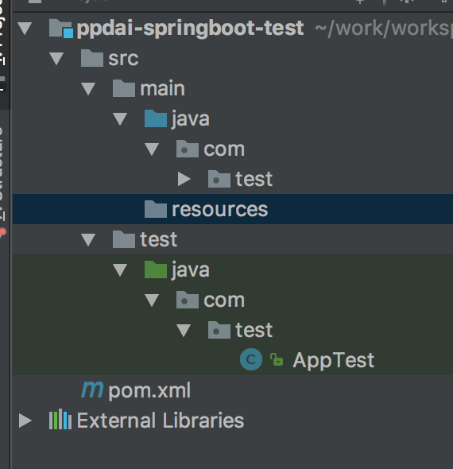
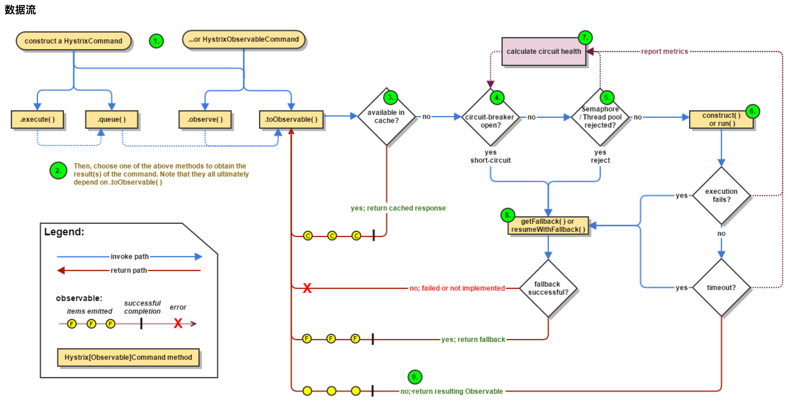
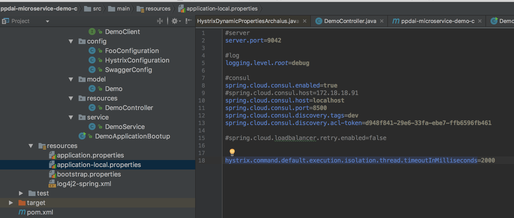
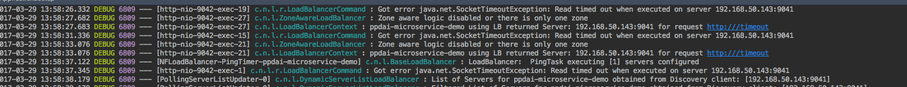

## architecture
---


## spring-boot
---
* 结合maven/gradle构建spring-boot项目
* 构建的时候加入spring-boot的pom支持
```
    <!-- Inherit defaults from Spring Boot -->
    <parent>
        <groupId>org.springframework.boot</groupId>
        <artifactId>spring-boot-starter-parent</artifactId>
        <version>2.0.0.BUILD-SNAPSHOT</version>
    </parent>

    <!-- Add typical dependencies for a web application -->
    <dependencies>
        <dependency>
            <groupId>org.springframework.boot</groupId>
            <artifactId>spring-boot-starter-web</artifactId>
        </dependency>
    </dependencies>

    <!-- Package as an executable jar -->
    <build>
        <plugins>
            <plugin>
                <groupId>org.springframework.boot</groupId>
                <artifactId>spring-boot-maven-plugin</artifactId>
            </plugin>
        </plugins>
    </build>
```

* 项目目录结构



* 完善项目信息
    - 在main目录下新建resources目录
    - 增加application.properties文件
    - 在application.properties中增加如下内容
```
spring.application.name=test
server.port=9009

logging.path=./data/logs/
logging.level.root=debug
```

* 增加spring-boot的启动支持
```
@SpringBootApplication
public class App {
    public static void main( String[] args ) {
        SpringApplication.run(App.class,args);
    }
}
```

* 创建restful接口
```
@RestController
@Slf4j
public class Demo {

    @GetMapping(value = "/demo")
    public String demo(){
        log.info("demo");
        return "demo";
    }

}     
```

* 中间需要加入slf4j的配置文件。启动springboot的应用，通过postman即可访问


## spring-cloud
* 项目加入springcloud的支持(结合consul)
```
<dependency>
      <groupId>org.springframework.cloud</groupId>
      <artifactId>spring-cloud-starter</artifactId>
      <version>1.1.7.RELEASE</version>
    </dependency>

    <dependency>
      <groupId>org.springframework.cloud</groupId>
      <artifactId>spring-cloud-dependencies</artifactId>
      <version>Camden.SR5</version>
    </dependency>

    <dependency>
      <groupId>org.springframework.cloud</groupId>
      <artifactId>spring-cloud-starter-consul-discovery</artifactId>
      <version>1.1.2.RELEASE</version>
    </dependency>
```

* 启动增加服务注册和发现的注解
```
@SpringBootApplication
@EnableDiscoveryClient
public class App {
    public static void main( String[] args ) {
        SpringApplication.run(App.class,args);
    }
}
```

* springcloud的上下文环境是整个bootapplication的父环境
```
A Spring Cloud application operates by creating a "bootstrap" context, which is a parent context for the main application. Out of the box it is responsible for loading configuration properties from the external sources, and also decrypting properties in the local external configuration files. The two contexts share an Environment which is the source of external properties for any Spring application. Bootstrap properties are added with high precedence, so they cannot be overridden by local configuration, by default.
The bootstrap context uses a different convention for locating external configuration than the main application context, so instead of application.yml (or .properties) you use bootstrap.yml, keeping the external configuration for bootstrap and main context nicely separate
```

* 增加bootstrap.properties配置文件
```
spring.application.name=test
server.port=9009
```

* 在application.properties中增加consul注册中心
```
spring.cloud.consul.host=localhost
spring.cloud.consul.port=8500
spring.cloud.consul.enabled=true
spring.cloud.consul.discovery.prefer-ip-address=true
spring.cloud.consul.discovery.instance-id=${spring.application.name}:${spring.cloud.client.ipAddress}:${server.port}
```

* 启动应用，登陆consul控制台，发现consul的服务critical


* 那是因为没有启动springboot的
```
    <dependency>
      <groupId>org.springframework.boot</groupId>
      <artifactId>spring-boot-starter-actuator</artifactId>
      <version>1.4.4.RELEASE</version>
    </dependency>
```

* 重新启动服务后正常


* 说明：常规服务注册是通过client注册到server上。本示例直接注册到server。不符合consul的架构原则。

## config

```
Spring Cloud Config provides server and client-side support for externalized configuration in a distributed system.
```

### configServer
* configServer是一个springboot项目。部署有两种方式：
    - 集群的方式部署，前端加nginx。
    - 服务注册的方式进行部署，注册到consul。configClient通过服务发现的方式调用。

* 代码的托管可以采用git或者svn的方式
```
spring:
  cloud:
    config:
      server:
        git:
          uri: https://github.com/spring-cloud-samples/config-repo
          username: trolley
          password: strongpassword
```

* bootstrap启动的时候如下
```
@SpringBootApplication
@EnableConfigServer
public class ConfigServer {
  public static void main(String[] args) {
    SpringApplication.run(ConfigServer.class, args);
  }
}
```

* 如果采用服务注册的方式，那么需要引入consul或者eureka组件。

* ** Force pull in Git Repositories **
    - 请参照http://cloud.spring.io/spring-cloud-config/spring-cloud-config.html
```
As mentioned before Spring Cloud Config Server makes a clone of the remote git repository and if somehow the local copy gets dirty (e.g. folder content changes by OS process) so Spring Cloud Config Server cannot update the local copy from remote repository.
To solve this there is a force-pull property that will make Spring Cloud Config Server force pull from remote repository if the local copy is dirty. Example:
spring:
  cloud:
    config:
      server:
        git:
          uri: https://github.com/spring-cloud-samples/config-repo
          force-pull: true
```

* 踩坑实录

```
<dependencyManagement>
    <dependencies>
      <dependency>
        <groupId>org.springframework.cloud</groupId>
        <artifactId>spring-cloud-dependencies</artifactId>
        <version>Brixton.RELEASE</version>
        <type>pom</type>
        <scope>import</scope>
      </dependency>
    </dependencies>
  </dependencyManagement>
```

但是config-server用的是1.3的版本，导致在验证的时候/health等报500内部错误。

**注意：springcloud 的版本一定要保持一致**


### configClient
* 请参照http://cloud.spring.io/spring-cloud-config/spring-cloud-config.html#_spring_cloud_config_client
* ** Config First Bootstrap ** 待续。。。。
* ** Discovery First Bootstrap ** 待续。。。。
* ** Config Client Fail Fast **。待续。。。。
* ** Config Client Retry **   待续。。。。

* 分布式刷新：采用cloud-bus的形式;cloud-bus可以用消息队列来实现。
    - 在客户端需要开启@Refreshscope注解。
* 在bootstrap.properties文件中增加注解
```
#config
spring.cloud.config.enabled=false
spring.cloud.config.discovery.enabled=${spring.cloud.config.enabled}
spring.cloud.config.discovery.service-id=ppdai-config-server
spring.cloud.config.fail-fast=true
```

## feign
```
Feign is a declarative web service client. It makes writing web service clients easier. To use Feign create an interface and annotate it. It has pluggable annotation support including Feign annotations and JAX-RS annotations. Feign also supports pluggable encoders and decoders. Spring Cloud adds support for Spring MVC annotations and for using the same HttpMessageConverters used by default in Spring Web. Spring Cloud integrates Ribbon and Eureka to provide a load balanced http client when using Feign.
```
* feign是一个声明式的客户端，springcloud的feign-client包含了ribbon和hystrix的支持
* 引入feign
```
    <dependency>
      <groupId>org.springframework.cloud</groupId>
      <artifactId>spring-cloud-starter-feign</artifactId>
      <version>1.2.3.RELEASE</version>
    </dependency>
```
* 项目启动增加feignclient的支持
```
@SpringBootApplication
@EnableDiscoveryClient
@EnableFeignClients
public class App {
    public static void main( String[] args ) {
        SpringApplication.run(App.class,args);
    }
}
```

* 增加client的目录，创建consumer的interface
```
@FeignClient(value = "xzxxxx")
public interface Demoa {

    @GetMapping(value = "/demo")
    public String demo();

}
## value:所要调用的服务的名字。
```
    
* 项目启动的时候会,context会实例化Demoa(singleton->FeignClientFactoryBean)


* feign存在重试:连接超时默认是10s，读取超时默认是60s，如果读取超时，这个时候会进行重试，并调用ribbo组件进行负载均衡，并发送请求。因此，在项目中注意，需要关闭底层的httpclient或者okhttpclient的重试，防止在通讯层出现重发。在服务端也要做好幂等。


* feign的超时重试机制在全局进行关闭
```
public class DemoApplicationBootup {
    public static void main(String[] args){
        SpringApplication.run(DemoApplicationBootup.class,args);
    }
    @Bean
    public Retryer retryer() {
        return Retryer.NEVER_RETRY;
    }
    @Bean
    Request.Options feignOptions() {
        return new Request.Options(/**connectTimeoutMillis**/4 * 1000, /** readTimeoutMillis **/ 10* 1000);
    }
}
```


* 在controller中可以直接注入Demoa实例
```
@RestController
@Slf4j
public class Demo {
    
    @Autowired
    Demoa demoa;

    @GetMapping(value = "/demo")
    public String demo(){
        log.info("demo");
        return "demo";
    }

}
```


## ribbon
Ribbon is a client side load balancer which gives you a lot of control over the behaviour of HTTP and TCP clients. Feign already uses Ribbon, so if you are using @FeignClient then this section also applies.
A central concept in Ribbon is that of the named client. Each load balancer is part of an ensemble of components that work together to contact a remote server on demand, and the ensemble has a name that you give it as an application developer (e.g. using the @FeignClient annotation). Spring Cloud creates a new ensemble as an ApplicationContext on demand for each named client using ** RibbonClientConfiguration **. This contains (amongst other things) an ILoadBalancer, a RestClient, and a ServerListFilter.

* 源码解析查看http://www.tuicool.com/articles/7VJzq2U
* 源码解析查看http://www.tuicool.com/articles/vANVFnM


## hystrix

* feign中已经包含了hystrix的支持，在启动的pom中加入hystrix
```
    <dependency>
      <groupId>org.springframework.cloud</groupId>
      <artifactId>spring-cloud-starter-hystrix</artifactId>
      <version>RELEASE</version>
    </dependency>
```
* hystrix支持两种模式进行隔离
    - 线程池模式
    - 信号量模式
* 线程池模式：在方法上加如下代码
```
@HystrixCommand(threadPoolKey = "hellopool",
            fallbackMethod = "test",
            commandProperties = {
                    @HystrixProperty(name = "execution.isolation.thread.timeoutInMilliseconds", value = "2000"),
                    @HystrixProperty(name = "metrics.rollingStats.numBuckets", value = "10"),
                    @HystrixProperty(name = "metrics.rollingStats.timeInMilliseconds", value = "10000"),
                    @HystrixProperty(name = "circuitBreaker.enabled", value = "true"),
                    @HystrixProperty(name = "circuitBreaker.requestVolumeThreshold", value = "5"),
                    @HystrixProperty(name = "circuitBreaker.sleepWindowInMilliseconds", value = "10000")
            })
    public String hello(){
        log.info("thrad local",String.valueOf(threadLocal.get()));
        return demoClient.hello();
    }
    public String test(){
        log.info("thrad local",String.valueOf(threadLocal.get()));
        return "fallback-cccccc";
    }
```
* 启动加载日志如下

* 解析如下
    - circuitBreaker.enabled：断路器开关，用来检测服务的是否健康，在断路器跳闸的情况下短路请求
        + hystrix.command.HystrixCommandKey.circuitBreaker.enabled
    - circuitBreaker.requestVolumeThreshold：最小请求数，用来跳闸回路。举个栗子，如果设置了20，就算19个请求都失败了也不会跳闸。
    - circuitBreaker.sleepWindowInMilliseconds：跳闸后，到下次短路判定的间隔时间
    - hystrix在用的时候，需要关闭feign的重试策略.具体关闭方法见feign描述。
    - 全局的超时可以用hystrix来控制，该超时的优先级最高，是全局的。

    - 在全局的超时下，对于某个方法，可以用hystrix进行超时的控制：
        + execution.timeout.enabled
        + execution.isolation.thread.timeoutInMilliseconds
        + fallback.enabled(hystrix.command.default.fallback.enabled)
        + hystrix.threadpool.default.coreSize=2：核心线程池size。HystrixCommands可以并发执行的最大数量。
        + hystrix.threadpool.default.maxQueueSize=-1：默认-1，使用SynchronousQueue。其他正数则使用LinkedBlockingQueue。队列大小在初始化时候生效，如果要动态改变队列大小参考queueSizeRejectionThreshold参数。如果要在SynchronousQueue 和LinkedBlockingQueue之间切换需要重新启动，以为着改变了队列大小并不改变当前的队列实现。

* 如果采用semaphore的方式，那么是同步的方式，thread.timeout不起作用。
## zuul
** Router and Filter **
```
Routing in an integral part of a microservice architecture. For example, / may be mapped to your web application, /api/users is mapped to the user service and /api/shop is mapped to the shop service. Zuul is a JVM based router and server side load balancer by Netflix.
```


## Archaius

## eureka
* ** eureka server **
* pom.xml:
```
    <parent>
        <groupId>org.springframework.boot</groupId>
        <artifactId>spring-boot-starter-parent</artifactId>
        <version>1.4.3.RELEASE</version>
        <relativePath/> <!-- lookup parent from repository -->
    </parent>

    <dependencies>
        <dependency>
            <groupId>org.springframework.cloud</groupId>
            <artifactId>spring-cloud-starter-eureka-server</artifactId>
        </dependency>
        <dependency>
            <groupId>org.springframework.boot</groupId>
            <artifactId>spring-boot-starter-test</artifactId>
            <scope>test</scope>
        </dependency>
    </dependencies>

    <dependencyManagement>
        <dependencies>
            <dependency>
                <groupId>org.springframework.cloud</groupId>
                <artifactId>spring-cloud-dependencies</artifactId>
                <version>Brixton.RELEASE</version>
                <type>pom</type>
                <scope>import</scope>
            </dependency>
        </dependencies>
    </dependencyManagement>

    <properties>
        <project.build.sourceEncoding>UTF-8</project.build.sourceEncoding>
        <start-class>eurekademo.EurekaApplication</start-class>
        <java.version>1.8</java.version>
        <docker.image.prefix>springcloud</docker.image.prefix>
    </properties>
```
* 启动类
```
@SpringBootApplication
@EnableEurekaServer
public class EurekaApplication {

    public static void main(String[] args){
        new SpringApplicationBuilder(EurekaApplication.class).web(true).run(args);
    }

}
```
* 配置文件application.yml
```
server:
  port: 8761

eureka:
  instance:
    hostname: localhost
  client:
    registerWithEureka: false #是否将eureka自身作为应用注册到eureka注册中心
    fetchRegistry: false #表示是否从eureka服务器获取注册信
    serviceUrl:
      defaultZone: http://localhost:${server.port}/eureka/  #设置eureka服务器所在的地址，查询服务和注册服务都需要依赖这个地址
  server:
    enable-self-preservation: false #是否开启自我保护(是否会清除已经下线的服务)
```

* 配置文件bootstrap.yml
```
spring:
  application:
    name: eureka
```

* 在server启动的时候，有个自我保护的选项需要注意下，默认是关闭的，下线的服务在catalog中不会自动清除，在eureka的控制台会有警告。可以通过如下关闭：
```
eureka:
    server:
        enable-self-preservation: false
```

* eureka可以采取集群部署的方式


* docker结合:在项目main目录下建立docker目录，新增Dockerfile文件


* ** eureka client **
* pom文件引入
```
<parent>
    <groupId>org.springframework.boot</groupId>
    <artifactId>spring-boot-starter-parent</artifactId>
    <version>1.4.5.RELEASE</version>
  </parent>

  <groupId>com.ppdai.erueka_client</groupId>
  <artifactId>eureka_client</artifactId>
  <version>1.0-SNAPSHOT</version>
  <packaging>jar</packaging>

  <name>eureka_client</name>

  <properties>
    <project.build.sourceEncoding>UTF-8</project.build.sourceEncoding>
    <java.version>1.8</java.version>
  </properties>


  <dependencyManagement>
    <dependencies>
      <dependency>
        <groupId>org.springframework.cloud</groupId>
        <artifactId>spring-cloud-dependencies</artifactId>
        <version>Camden.SR6</version>
        <type>pom</type>
        <scope>import</scope>
      </dependency>
    </dependencies>
  </dependencyManagement>
  <dependencies>
    <dependency>
      <groupId>org.springframework.cloud</groupId>
      <artifactId>spring-cloud-starter-eureka</artifactId>
    </dependency>
    <dependency>
      <groupId>org.springframework.boot</groupId>
      <artifactId>spring-boot-configuration-processor</artifactId>
    </dependency>
    <dependency>
      <groupId>junit</groupId>
      <artifactId>junit</artifactId>
      <version>4.12</version>
    </dependency>
  </dependencies>
```
* 启动类:(i.e. utterly normal Spring Boot app). In this example we use @EnableEurekaClient explicitly, but with only Eureka available you could also use @EnableDiscoveryClient. Configuration is required to locate the Eureka server
```
@SpringBootApplication
@EnableEurekaClient
@EnableDiscoveryClient
public class App {
    public static void main(String[] args) {
        new SpringApplicationBuilder(App.class).web(true).run(args);
    }
}
```

## consul
* consul参考官网http://consul.io
* consul架构图

```
(LAN:局域网 ;WAN:广域网)
client与client之间走gossip协议，协议端口是8301
client与server之间数据同步也是走gossip协议，端口是8301
client与server的rpc走tcp协议，走的是8300端口
server与server之间的复制raft协议走的是tcp协议，端口是8300
不同的dc之间的数据请求走的是8300端口
不同的dc的server之间走的gossip协议，端口广域网的8302端口
```

* gossip协议
```
1. gossip背景
Gossip算法如其名，灵感来自办公室八卦，只要一个人八卦一下，在有限的时间内所有的人都会知道该八卦的信息，这种方式也与病毒传播类似，因此Gossip有众多的别名“闲话算法”、“疫情传播算法”、“病毒感染算法”、“谣言传播算法”。  但Gossip并不是一个新东西，之前的泛洪查找、路由算法都归属于这个范畴，不同的是Gossip给这类算法提供了明确的语义、具体实施方法及收敛性证明。
2. gossip特点
Gossip算法又被称为反熵（Anti-Entropy），熵是物理学上的一个概念，代表杂乱无章，而反熵就是在杂乱无章中寻求一致，这充分说明了Gossip的特点：在一个有界网络中，每个节点都随机地与其他节点通信，经过一番杂乱无章的通信，最终所有节点的状态都会达成一致。每个节点可能知道所有其他节点，也可能仅知道几个邻居节点，只要这些节可以通过网络连通，最终他们的状态都是一致的，当然这也是疫情传播的特点。  要注意到的一点是，即使有的节点因宕机而重启，有新节点加入，但经过一段时间后，这些节点的状态也会与其他节点达成一致，也就是说，Gossip天然具有分布式容错的优点
3. gossip本质
Gossip是一个带冗余的容错算法，更进一步，Gossip是一个最终一致性算法。虽然无法保证在某个时刻所有节点状态一致，但可以保证在”最终“所有节点一致，”最终“是一个现实中存在，但理论上无法证明的时间点。
因为Gossip不要求节点知道所有其他节点，因此又具有去中心化的特点，节点之间完全对等，不需要任何的中心节点。实际上Gossip可以用于众多能接受“最终一致性”的领域：失败检测、路由同步、Pub/Sub、动态负载均衡。  但Gossip的缺点也很明显，冗余通信会对网路带宽、CUP资源造成很大的负载，而这些负载又受限于通信频率，该频率又影响着算法收敛的速度，后面我们会讲在各种场合下的优化方法。
4. Gossip节点的通信方式及收敛性 
参照：http://wenku.baidu.com/link?url=SSCHAAXypcJvYrDkZL4RRUSMgxeQl9nb1EOaLBsk21PyB1Z9GfXsQ2jkVTDElRJwqUn2QFxV6ut-5Dz1Dki8Rt34BOSAEoXH-YQ-1ZTm46O
```
* consul的部署
    *   根据不同的的操作系统版本，下载最新consul客户端,最新的版本集成了web-ui,只要在部署的开启ui即可。
    * ‘单机部署’
    
        *   下载consul安装文件。
        *   准备启动脚本

        ```
        consul agent -server -bootstrap -datacenter=zjtest1 -data-dir=./temp/consul/server -ui=true
        ```

        *   启动脚本说明
            *  server:  This indicates whether the agent is running in server or client mode
            *  bootstrap:   a server may be in "bootstrap" mode 
            *  datacenter:  The -datacenter flag can be used to set the datacenter
        * 启动日志
        
        ```
            2017/03/23 15:55:40 [WARN] raft: Heartbeat timeout from "" reached, starting Election
            2017/03/23 15:55:40 [INFO] raft: Node at 192.168.50.150:8300 [Candidate] entering Candidate state in term 2
            2017/03/23 15:55:40 [INFO] raft: Election won. Tally: 1
            2017/03/23 15:55:40 [INFO] raft: Node at 192.168.50.150:8300 [Leader] entering Leader state
            2017/03/23 15:55:40 [INFO] consul: cluster leadership acquired
            2017/03/23 15:55:40 [INFO] consul: New leader elected: JundeMacBook-Pro.local
            2017/03/23 15:55:40 [INFO] consul: member 'JundeMacBook-Pro.local' joined, marking health alive
            2017/03/23 15:55:42 [INFO] agent: Synced service 'consul'
        ```

        * 部署完成后可以查看
        
        ```
$ consul members
Node                    Address              Status  Type    Build  Protocol  DC
JundeMacBook-Pro.local  192.168.50.150:8301  alive   server  0.7.2  2         zjtest2
        ```

    * 集群部署
        * server建议至少三个点部署。
        * 所有的server不能以bootstrap的方式运行，否则会产生状态的不一致，如下引用原文说明
        
        ```
        Multiple servers cannot be in bootstrap mode as that would put the cluster in an inconsistent state.
        ```
        
        * 部署步骤
            - 以bootstrap方式部署一台server    
            - 其他server以join的方式加入
            - 优雅下线该bootstrap的server
            - 加入到剩余中的任意一台
               
        * 部署完成后，可以通过consul members进行查看集群状态


