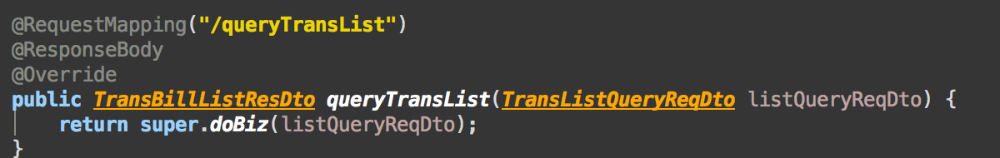
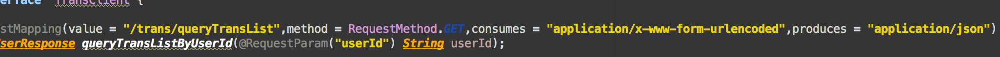

# 记录一次踩坑(consumes和produces的用法)
## 服务提供方

 
请求参数就一个userId,用springmvc的模式的controller注解。

## 服务调用方，这里采用feign-client


* 这里有几个注意点
    - 请求用requestParam来注解。默认会在请求参数后面加上?userId={userId}。
    - 对于produces和consumes的理解，请看如下截图。


所以，从这里可以看出对于请求方注解produces，代表的是http报文头重的Accept。而consumes代表的是http报文头重的Content-type。

所以，大家不用弄反了哦。如下，再将http的报文头含义释明下：

```
1.Accept属于请求头， Content-Type属于实体头。

Http报头分为通用报头，请求报头，响应报头和实体报头。

请求方的http报头结构：通用报头|请求报头|实体报头

响应方的http报头结构：通用报头|响应报头|实体报头

2.Accept代表发送端（客户端）希望接受的数据类型。

比如：Accept：text/xml;

代表客户端希望接受的数据类型是xml类型

Content-Type代表发送端（客户端|服务器）发送的实体数据的数据类型。

比如：Content-Type：text/html;

代表发送端发送的数据格式是html。

二者合起来，

Accept:text/xml；

Content-Type:text/html

即代表希望接受的数据类型是xml格式，本次请求发送的数据的数据格式是html。

作者：AwesomeChen
链接：http://www.jianshu.com/p/2359ff7d1800
來源：简书
著作权归作者所有。商业转载请联系作者获得授权，非商业转载请注明出处。
```