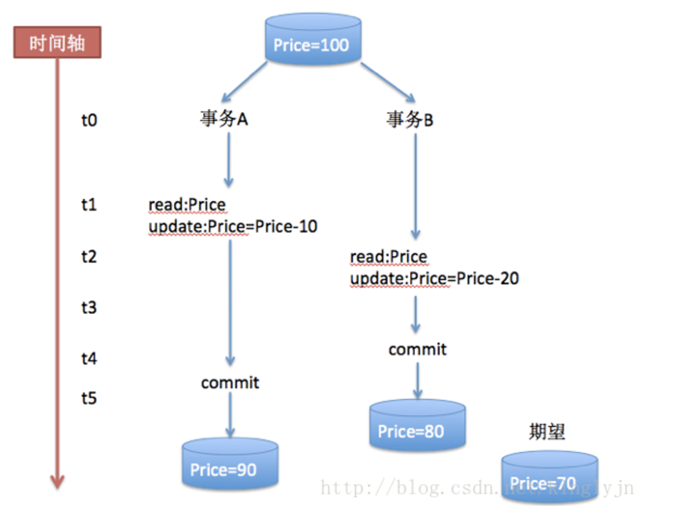

# ACID Propagation

**数据库事务的四个基本性质简介**

* 原子性（Atomicity），在一个事务中的所有操作，相当于一个原子操作，要么全部成功，要么全部失败。
* 一致性（Consistency），就是在事务执行前后，对于事务本身的用意而言，数据库中的数据是保持一致的，数据库的一致性是建立在原子性的基础之上的，更多的由编码的程序员保证，最经典的案例是A，B帐号之间的转账。
* 隔离性（Isolation），事务的隔离性是指事务和事务之间的数据可见性，这也是本文需要详细介绍的地方。数据库定义了各种隔离级别，以在并发性和数据完整性中权衡。
* 持久性（Durability），事务完成以后，所有的数据都将持久到数据库中，不会因为其他原因而丢失。

**数据据库并发性带来的问题：**

* 脏读（Dirty Reads）：所谓脏读就是对脏数据（Drity Data）的读取，而脏数据所指的就是未提交的数据。也就是说，一个事务正在对一条记录做修改，在这个事务完成并提交之前，这条数据是处于待定状态的（可能提交也可能回滚），这时，第二个事务来读取这条没有提交的数据，并据此做进一步的处理，就会产生未提交的数据依赖关系。这种现象被称为脏读。
* 不可重复读（Non-Repeatable Reads）：一个事务先后读取同一条记录，但两次读取的数据不同，我们称之为不可重复读。也就是说，这个事务在两次读取之间该数据被其它事务所修改。
* 幻读（Phantom Reads）：一个事务按相同的查询条件重新读取以前检索过的数据，却发现其他事务插入了满足其查询条件的新数据，这种现象就称为幻读。

**事务的隔离级别**

数据库的隔离级别主要分为四级，隔离级别越高，并发性就越低，一致性就越高。

数据库事务的四个基本性质简介

原子性（Atomicity），在一个事务中的所有操作，相当于一个原子操作，要么全部成功，要么全部失败。
一致性（Consistency），就是在事务执行前后，对于事务本身的用意而言，数据库中的数据是保持一致的，数据库的一致性是建立在原子性的基础之上的，更多的由编码的程序员保证，最经典的案例是A，B帐号之间的转账。
隔离性（Isolation），事务的隔离性是指事务和事务之间的数据可见性，这也是本文需要详细介绍的地方。数据库定义了各种隔离级别，以在并发性和数据完整性中权衡。
持久性（Durability），事务完成以后，所有的数据都将持久到数据库中，不会因为其他原因而丢失。

数据据库并发性带来的问题：

脏读（Dirty Reads）：所谓脏读就是对脏数据（Drity Data）的读取，而脏数据所指的就是未提交的数据。也就是说，一个事务正在对一条记录做修改，在这个事务完成并提交之前，这条数据是处于待定状态的（可能提交也可能回滚），这时，第二个事务来读取这条没有提交的数据，并据此做进一步的处理，就会产生未提交的数据依赖关系。这种现象被称为脏读。
不可重复读（Non-Repeatable Reads）：一个事务先后读取同一条记录，但两次读取的数据不同，我们称之为不可重复读。也就是说，这个事务在两次读取之间该数据被其它事务所修改。
幻读（Phantom Reads）：一个事务按相同的查询条件重新读取以前检索过的数据，却发现其他事务插入了满足其查询条件的新数据，这种现象就称为幻读。

事务的隔离级别

数据库的隔离级别主要分为四级，隔离级别越高，并发性就越低，一致性就越高。

1、读未提交 （Read UnCommited）

这是数据库最弱的隔离级别（完全不隔离），存在脏读、不可重复读、幻读的诸多问题。示例如下：

由于事务B读取了事务未提交的数据，一旦回滚，事务B读取的数据就是有问题的。

2、读已提交（Read Commited）

这个级别不允许事务B读取事务A还未提交的update操作更新后的数据（对于事务A的insert操作，在未提交之前，对事务B还是可见的）。避免了脏读，但还可能出现不可重复读、幻读。示例如下：

这里面不会出现脏读，保证事务B读取的都是事务A update提交之后的数据。但是事务之间还是会存在互相影响的情况（不可重复读），见下面的例子：

事务A和事务B都是先读取Price的价格，然后在价格上面减去一定的数值，我们期望结果是70，但是实际结果可能是90，也可能是80。

3、可重复读（Repeatable Read）

所有被Select获取的数据都不能被修改，这样就可以避免一个事务前后读取数据不一致的情况。但是却没有办法控制幻读，因为这个时候其他事务不能更改所选的数据，但是可以增加数据，因为前一个事务没有范围锁。

该隔离级别消除了不可重复读，但因为对于事务A的insert操作事务B还是可见的，所以是还是存在幻读的现象。

4、可序列化读（Serialize）

事务之间最高的隔离界别，只能顺序的读取数据，当一个事务在读取和修改数据的时候，另外一个事务只能挂起，直到正在读取和修改数据的事务提交之后，挂起的事务才能执行。

以上这些隔离级别都是定义在java.sql. Connection中，在获取连接的时候我们可以进行设置，但是一般情况下，系统会用数据库默认的级别来设置。

* Connection.TRANSACTION_READ_UNCOMMITTED;
* Connection.TRANSACTION_READ_COMMITTED;
* Connection.TRANSACTION_REPEATABLE_READ;
* Connection.TRANSACTION_SERIALIZABLE;

小结：

**事务的传播属性**

我们在使用Spring或者EJB声明式编程的时候，还会接触到事务的传播属性（Propagation），在spring的 TransactionDefinition 类里面进行定义。具体有以下几个数值：

* Required(需要)
* Mandatory(强制必须)
* RequiresNew(需要新的)
* Supports(支持)
* NotSupported(不支持)
* Never(不用)

Required：当前方法必须要求开启事务，如果当前线程不存在事务，则开启新的事务，如果当前线程已经存在事务，就加入到当前事务。这个是经常使用的。但是要注意的就是一旦事务中某一个方法回滚，当前事务上下文里面所有的操作都回滚，考虑到下面一个例子：

假设A和B的事务都是Required，那么当调用MethodA的时候，如果methodB回滚了，对A的修改也就回滚了。所以上面的代码不会达到预期的结果，也就是说A不可能修改成为99。

Required New：当前方法必须要求开启新的事务，如果当前线程已经存在事务上下文，就暂停当前事务，等到新事务结束之后，再继续恢复之前的事务。就拿上面的例子来说，methodB的对事务的修改不会影响到methodA。两个事务之间不会互相影响。经常可以用到的场景就是在业务发生异常的时候发送短消息。如果业务发生异常，业务回滚，但是由于发送段消息是新的事务，不会受到业务异常的影响。

Mondary：当前方法必须要求事务，如果当前线程不存在事务，就抛出异常，如果存在，就加入到事务里。

Support：当前方法支持事务，如果当前线程存在事务，就加入到事务中去，如果不存在，不做任何操作。

Not Support：当前方法不支持事务，如果当前线程存在事务，就挂起当前事务，执行完当前方法，恢复事务。一般情况下在查询的时候使用，如果一个方法只是查询，并且非常耗时，就可以使用Not Support，避免事务时间超长。

Never：当前方法不支持事务，如果当前线程存在事务，则抛出异常。这种用的比较少。

